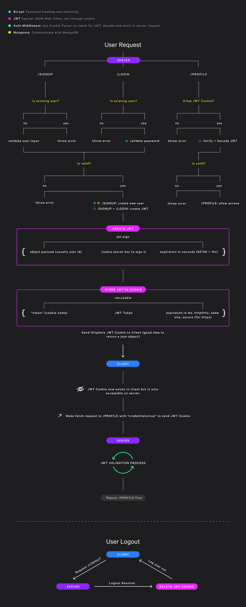
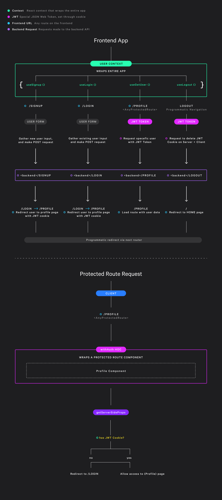

# Next.js with MongoDB Auth

This is a sample project that uses Next.js and MongoDB to create users. This project illustrates how to use JWT cookies to authorize user access to protected routes.

### The Next.js serverless backend contains 3 API routes:

- Signup
- Login
- Profile
- Logout

With these routes, new users can sign up, login, and view a protected route, like the `/profile` page. When they logout, their JWT cookie session is deleted.

### The frontend uses Next.js to:

- Create new users
- Log users in
- Do client side validation for protected routes, like `/profile`

<br/>

## How the backend works:



<br/>

## How the frontend works:



<br/>

# Getting Started

### Create a new MongoDB cluster

To use this project, you will need to create a new MongoDB cluster via a new project. This can be done on [MongoDB Atlas](https://www.mongodb.com/cloud/atlas).

### Create a new `.env` file

In the root of this directory create a new `.env.local` file with the following information:

```
DB_ENV = "testing"
FRONTEND_URL = <YourFrontendURL>
MONGO_URL = <YourMongodbURL>
SECRET_JWT_KEY = <AnySuperSecretKey>
```

### Install dependencies and start up the servers:

Make sure you are in the root directory of this project. Then, in your terminal:

```
npm install
npm run dev
```

These commands will install of the dependencies for your project, and start your servers up.

### Create a new user

Create new user, using the Next js frontend. Visit `http://localhost:3000/signup` and create a new user.

```
"username": "henry",
"email": "henry@gmail.com",
"password": "1234RTD2"
```

A few things should happen:

- MongoDB Atlas should now show that new user.
- You should get a response that includes the JWT cookie (check Dev Tools > Application > Cookies)
- The client should automatically transition to the `/profile` page and showcase the new `username`.

<br/>

# The Backend Project Structure

Next.js uses serverless functions for server-side functionality. This means API routes can be created with Next.js. These functions run on demand, which means they run as stand alone instances. This is different than Express which provides one server for all API routes.

### pages/api

This folder contains your next.js API routes and resolvers.

### models

This folder contains the `User` model. This is used in the `resolvers` to create new users and find existing ones.

### middlewares

This folder contains functions that run for certain api routes when requests are made.

- `connectDb.js`: this middleware connects mongoose to an existing mongodb cluster.

- `withCors.js`: this middleware allows certain origins and credentials, e.g. JWT cookie, to be sent. It should be noted, that cors only effects browser requests, and shouldn't be used for all security purposes.

- `isAuthorized.js`: this middleware checks to see if the user has a JWT cookie, decodes that cookie, and attaches the `user.id` to the `req` object. Any route that uses this middleware, e.g. `/profile`, will get access to the `user.id`

- `all.js`: this middleware leverages [next-connect](https://www.npmjs.com/package/next-connect) to chain `connectDb.js` and `withCors.js` together. `all.js` is then used in any API route that needs it.

### lib

This folder contains helper functions:

- `generateTokens.js`: this function generates a new JWT cookie, which Next.js API routes can then use.

- `withAuth`: this is a middleware function that is responsible for verifying incoming JWT's, when a User tries to access the `Profile` route which is protected. The auth route looks for the JWT in the `req.header.token`. However, for security purposes this should be transferred over to an `httpOnly` cookie.

<br/>

# The Frontend Project Structure

### state

This folder provides some global context to our entire app. It provides core functionality for:

- signing new users up
- logging users in
- logging users out
- fetching users

### components

All of the next js components. Much of the `Form` logic has been abstracted away. The primary thing to keep in mind is that when the `submit` button is clicked, the client fires off a request to the backend with that users information.

### pages

All of the next js pages. For the most part these just display a `Form` component.

### lib and `withAuth`

This directory contains a very important Higher Order Function, `withAuth`. This function can wrap any protected page, like `profile`, and validate whether the user is signed in via a JWT Cookie. It does this by checking for the cookie via `getServerSideProps`. If this user is signed in, let them proceed to the route. Otherwise, navigate them to the `login` page.

In practice, it looks like this:

```
export const getServerSideProps = (context) => {
  return withAuth.isAuthorized(context);
};

function ProfilePage(props) {
  return (
    <ProfilePageStyles>
      <Profile />
    </ProfilePageStyles>
  );
}

export default withAuth(ProfilePage);
```

# Resources:

Here are a few articles that helped with making this project:

- [Remaining Stateless - JWT + Cookies in Node JS by Ogbonna Basil](https://dev.to/mr_cea/remaining-stateless-jwt-cookies-in-node-js-3lle)

- [Client-side Authentication the Right Way (Cookies vs. Local Storage)](https://www.taniarascia.com/full-stack-cookies-localstorage-react-express/)

- [JWT authentication: When and how to user it](https://blog.logrocket.com/jwt-authentication-best-practices/)

- [Next.js Cookies](https://maxschmitt.me/posts/next-js-cookies/)

- [Learn how HTTP Cookies work](https://flaviocopes.com/cookies/#set-a-cookie-expiration-date)

- [Hashing in Action: Understanding bcrypt](https://auth0.com/blog/hashing-in-action-understanding-bcrypt/)

- [Next.js redirect after user logs in](https://nextjs.org/docs/api-reference/next/router#usage-2)

- [Next.js Authenticating Server-Rendered Page](https://nextjs.org/docs/authentication#authenticating-server-rendered-pages)

- [Middleware in Next.js](https://hoangvvo.com/blog/nextjs-middleware)

- [Next.js API Middlewares](https://nextjs.org/docs/api-routes/api-middlewares)

- [Next.js Mongodb App in Github](https://github.com/hoangvvo/nextjs-mongodb-app)

# App Dependencies:

```
  "dependencies": {
    "bcrypt": "^5.0.1",
    "cookies": "^0.8.0",
    "cors": "^2.8.5",
    "jsonwebtoken": "^8.5.1",
    "mongoose": "^5.11.18",
    "next": "10.0.7",
    "next-connect": "^0.10.0",
    "react": "17.0.1",
    "react-dom": "17.0.1",
    "styled-components": "^5.2.1",
    "swr": "^0.4.2"
  }
```

# Next Steps

From here, you can test out the different pieces, and see how it all works. The next step for this project is to try out using Next.js `useSWR` package for all client requests. And, eventually transferring the entire backend over to Next.js, serverless functions via the `api` folder.
